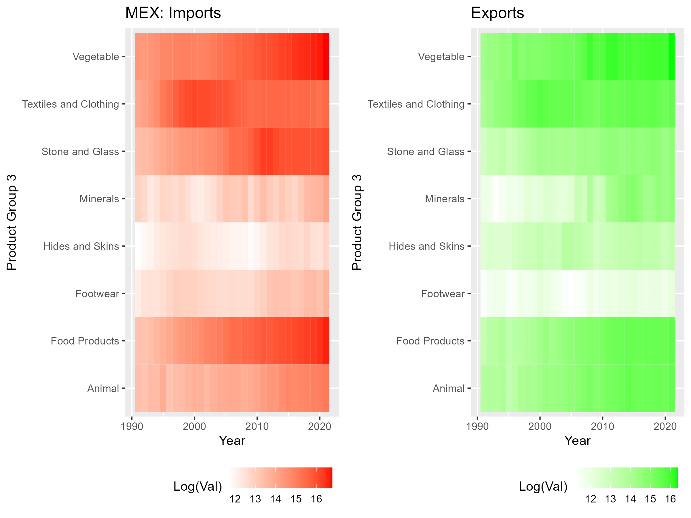
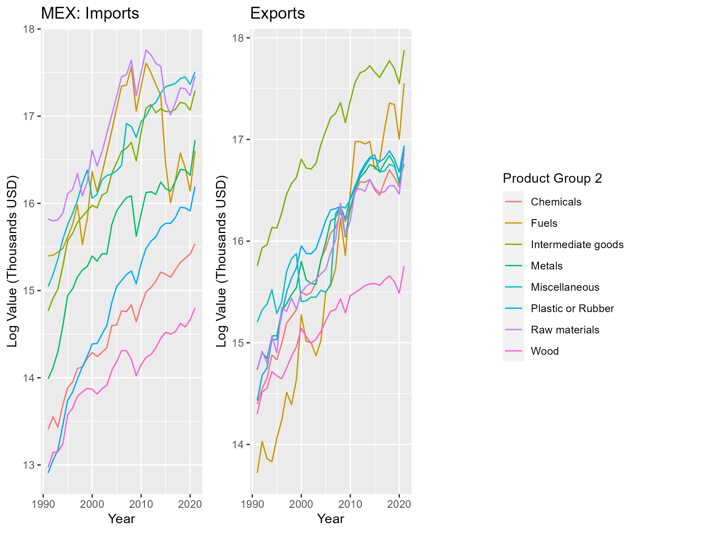
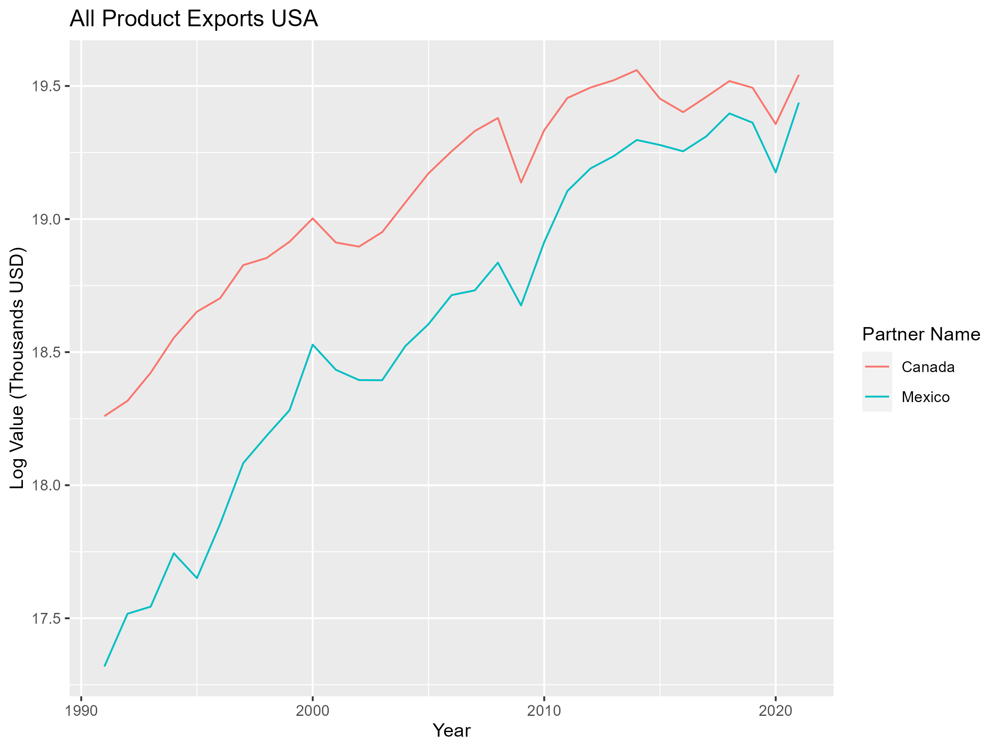

**1. Project Overview and Data Description:**
Our research project focuses on examining the impact of the North American Free Trade Agreement (NAFTA) on various industry sectors in the United States through out its course from 1994 to 2020. Initially, we intended to study the transition from NAFTA to USMCA, but due to a lack of sufficient data, we redirected our focus to the effects of NAFTA's implementation using all data available, 1991-2021. This shift is pivotal as it allows us to delve into the long-term impacts and changes induced by NAFTA, especially relevant since its recent termination in 2020. Our study is grounded in data sourced from the World Integrated Trade Solutions, comprising four key CSV files: `CAN_exp.csv`, `CAN_Imp.csv`, `MEX_exp.csv`, and `MEX_imp.csv`. These files provide a comprehensive view of export and import volumes between the U.S., Canada, and Mexico, offering a rich dataset to analyze the trade dynamics under NAFTA.

**2. Enhanced Data Processing and Methodology:**
Our data processing began with restructuring each dataset into a long format, where 'Year' was set as the primary key. This transformation was essential as it allowed us to create a uniform structure across all datasets, where each row now represented a unique year-product combination, making the data more conducive for trend analysis. Following this, we merged the four datasets into a single aggregated data frame. This merger was crucial for providing a comprehensive view of the trade dynamics, enabling us to analyze trends across different countries and industry sectors in a unified manner.

To ensure the integrity and cleanliness of our data, we undertook several steps. All categorical variables were transformed into factors with their corresponding levels to facilitate categorical analysis. We meticulously checked for corrupt, irrelevant, or garbage data, and confirmed the absence of missing values (NA’s). The 'Indicator' column, deemed unnecessary for our analysis, was removed to streamline the dataset. The final step was to arrange the dataset in a specific column order: `Reporter Name`, `Year`, `Partner Name`, `Trade Flow`, `Product Group`, `Value`. This arrangement was chosen for its logical flow and ease of analysis.

**3. Detailed Data Transformation and Cleaning:**
We first visualized Imports from Mexico and Exports to Mexico from 1991 to 2021 using two heat maps respectively. This visualization highlighted macroeconomic trends, including the impacts of the 2008 financial crisis and the COVID-19 pandemic in 2020. Similarly, we plotted line charts based on individual products, but this approach proved to be too cluttered and uninformative. The heat maps were also showing effect for some Product Groups but not all. To address this, we grouped the products into three categories based on their mean values:

In order to understand how we wanted to group our 21 Product Group members we needed a better understanding of their differences in scale. The trade_volume_df$Value column starting In thousands. I then converted the column to Millions and even went to convert it into Billions. Creating a summary statistic table (Viz # 1) by descending order of highes to lowest in mean value, we were able to see which groups were close to each other in scale. The following were grouped from greatest to lowest by mean value scale in Billions. 

- Group 1: "Capital goods", "Consumer goods", "Mach and Elec", "Transportation"
- Group 2: "Intermediate goods", "Fuels", "Raw materials", "Miscellaneous", "Metals", "Chemicals", "Plastic or Rubber", "Wood"
- Group 3: "Vegetable", "Food Products", "Stone and Glass", "Textiles and Clothing", "Animal", "Minerals", "Hides and Skins", "Footwear"

This grouping allowed for more focused analysis, although identifying trends remained challenging. To enhance comparability, we converted the 'Value' from Thousands in USD to log(Thousands in USD). This final, Value transformation was a crucial step, as it normalized the data and enabled more effective comparisons between not only the groups but also within individual products. Subsequent visualizations using this transformed data offered clearer insights.

For the purpose of this report, our analysis will primarily focus on imports and exports between the US and Mexico. Additional transformations included scaling values from thousands to millions, and then to billions, before reverting to thousands in logarithmic form. These steps, though intricate, were essential in distilling our dataset into a format that revealed more nuanced and interpretable trends.

**4. Synthesized Findings and Analysis:**

Our comprehensive analysis of the NAFTA-influenced trade data reveals a notable increase in trade volume across almost all product categories, suggesting NAFTA's substantial role in enhancing trade between the U.S. and Mexico. This trend is particularly pronounced in sectors such as Capital Goods, Transportation, Machinery, and Technology, where we observed the most significant rises in both imports and exports. These increases are indicative of deepened economic integration, highlighted by Mexico emerging as the U.S.'s largest trading partner in 2019. The transformation in the Transportation sector aligns with NAFTA's objectives to boost the automotive trade. In contrast, the Textiles and Clothing sector initially experienced explosive growth but later declined, likely due to advancements in automation and a shift towards smaller, domestic clothing brands in the U.S. The Food Products sector, particularly Vegetables, showed considerable growth, reflecting increased demand for healthy foods and NAFTA’s role in facilitating this trade. However, low-end manufacturing sectors like footwear experienced stagnation or decline, possibly due to Mexico's pivot towards higher-end manufacturing. These findings underscore NAFTA's influence in reshaping the trade landscape, though its precise impact is intertwined with broader global economic trends.

**Executive Summary:**

Our research project aimed to unravel the impact of the North American Free Trade Agreement (NAFTA) on various industry sectors in the United States, focusing particularly on trade relations with Mexico and Canada. A critical finding from our analysis is the substantial increase in US-Mexico exports, which have surged by an impressive 418.36% since NAFTA's implementation. This remarkable growth underscores NAFTA's significant role in enhancing bilateral trade relations. Furthermore, the data reveals that Canada exports 12% more than Mexico to the U.S., highlighting the varied effects of NAFTA on different trade corridors.

The project's methodology involved data processing and analysis, incorporating data transformation and cleaning to ensure accuracy and reliability. Our approach to structuring the data into manageable groups allowed for a focused examination of sector-specific trends. The increase in trade volumes was particularly notable in sectors like Capital Goods and Transportation, reflecting NAFTA's influence in these areas. However, our analysis also indicated that the trends in trade volumes and values were in line with broader global economic trends, such as the 2008 financial crisis and the COVID-19 pandemic, affecting trade dynamics significantly.

While our findings indicate a clear trend of increased trade volume and integration between the U.S., Mexico, and Canada, attributing these changes solely to NAFTA is complex. The agreement undoubtedly played a crucial role, but its impact is entangled with other macroeconomic factors. For a more precise understanding of NAFTA's exclusive influence, further in-depth analysis is required, integrating broader economic data to differentiate the effects of NAFTA from other global economic trends. This nuanced approach will be pivotal in our future research endeavors, aiming to isolate and quantify the specific contributions of NAFTA to the observed trade patterns and sectoral shifts.

In summary, our research provides valuable insights into the effects of NAFTA on U.S. trade, highlighting significant increases in trade volumes and pointing to deeper economic integration. However, the exact extent of NAFTA's impact, distinct from other economic factors, remains an area for further detailed investigation.

